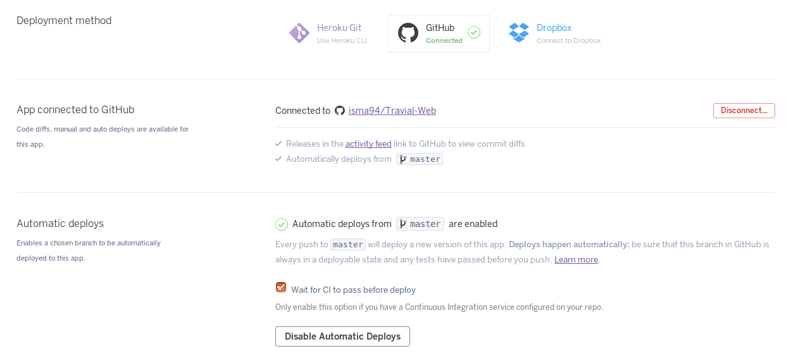

En este hito, he configurado mi repositorio de GitHub para combinar integración y despliegue continuos. De esta forma, cada ```git push``` envía la nueva versión del código al sistema de integración continua, que se encarga de ejecutar los test. Si esta nueva versión pasa los test, se envía finalmente al PaaS para que despliegue la aplicación.


## Elección de PaaS: Heroku

He elegido el servicio Heroku, puesto que tiene un servicio gratuito que es suficiente para los requisitos de mi proyecto, lo utilizamos en los ejercicios del tema 3 y ademaś tiene una amplia documentación. Heroku cumple los dos requisitos exigidos en el hito para la elección del PaaS:

  * La configuración se puede definir mediante órdenes utilizando el **toolbelt** de Heroku (Heroku CLI), de forma que otra persona pueda reproducir la infraestructura y desplegar el mismo proyecto. Para facilitarle el trabajo, esta persona simplemente tendría que ejecutar el siguiente script para desplegar el proyecto:

  ```bash
  # Instalar Heroku CLI
  wget -O- https://toolbelt.heroku.com/install-ubuntu.sh | sh
  # Hacer login en Heroku
  heroku login
  # Clonar repositorio de la aplicacion
  git clone https://github.com/isma94/Travial-Web
  cd Travial-Web
  # Crear aplicacion en heroku
  heroku create
  # Desplegar aplicacion
  git push heroku master

  ```

  Para comprobar que este despliegue se ha realizado correctamente, podemos ejecutar las siguientes órdenes, la última de las cuales lanzará la aplicación para que podamos verlo directamente.

  ```bash
  # Asegurarse de que se esta ejecutando al menos una instancia
  heroku ps:scale web=1
  # Lanzar aplicacion
  heroku open
  ```

  * Permite **despliegue continuo**, es decir, que haciendo push desde el repositorio de GitHub se despliegue la nueva versión en el PaaS (siempre que pase las pruebas en el servicio de CI).

  Esto lo he realizado mediante la interfaz web de Heroku, que nos permite conectar un proyecto con GitHub y con un servicio de CI. Activando ambas opciones, Heroku esperará a que el servicio de CI asociado al repositorio pase los tests y, si éstos son satisfactorios, obtendrá la nueva versión y procederá a desplegarla.

  


## Otras configuraciones

Además de lo anterior, he tenido que añadir al archivo .travis.yml las siguientes líneas para que Travis pudiera realizar los test con PostgreSQL.

```yml
services:
  - postgresql
before_script:
  - psql -c "CREATE USER isluji WITH PASSWORD 'basedatos';" -U postgres
  - psql -c "ALTER USER isluji CREATEDB;" -U postgres
```
