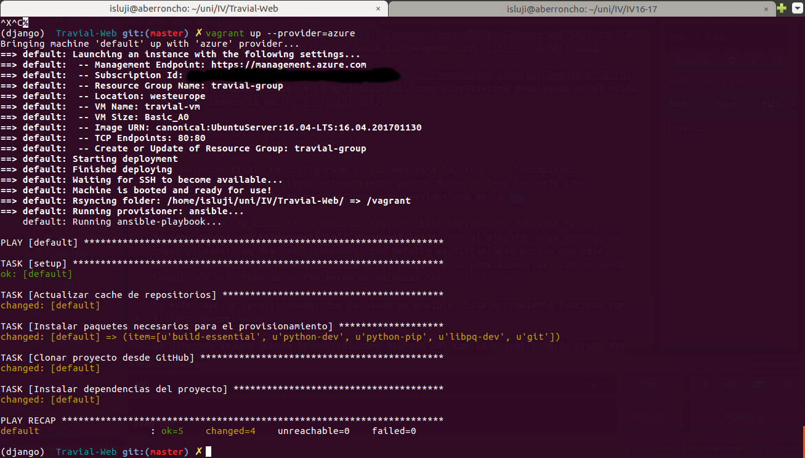

# Hito 5

## Diseño del soporte virtual para el despliegue de una aplicación

En este hito, voy a desarrollar una forma de provisionar y desplegar mi aplicación en una máquina virtual de manera automatizada, portable y reproducible utilizando el gestor de máquinas virtuales Vagrant, el provisionador Ansible y la herramienta de despliegue Fabric. Como IaaS en el que alojar las máquinas virtuales, utilizaré Azure de Microsoft.


### Instalación del software necesario

Primero, hemos de descargar Vagrant. Si utilizamos Ubuntu como SO, éste se encuentra entre los paquetes de dicha distribución (apt), pero sólo hasta la versión 1.8.1. Para obtener la última versión (1.9.1), hemos de descargarla de la página oficial:

```bash
wget https://releases.hashicorp.com/vagrant/1.9.1/vagrant_1.9.1_x86_64.deb
sudo dpkg -i vagrant_1.9.1_x86_64.deb
rm vagrant_1.9.1_x86_64.deb
```

Para poder lanzar máquinas de Azure de forma remota desde Vagrant, necesitamos el plugin provisionador de Azure para Vagrant (instalamos específicamente esta versión para evitar problemas de incompatibilidad):

```bash
vagrant plugin install vagrant-azure --plugin-version '2.0.0.pre1'
```

Las instalaciones de Ansible y de Fabric son más sencillas, puesto que podemos instalarlos con sendos comandos de pip.

```bash
pip install ansible fabric
```


### Configuración del IaaS

Necesitamos realizar una serie de acciones en Azure, con las que obtenemos ciertos identificadores y claves que usaremos para conectar con ella desde Vagrant. Se pueden hacer tanto desde el portal como utilizado el CLI, utilizaremos ambas según nos convenga.

* Primero, hemos de obtener los datos de la suscripción que vamos a utilizar con el comando ```az account show```.


De este objeto, hemos de quedarnos con la variable **id**. La exportamos como variable de entorno:

```bash
export AZURE_SUBSCRIPTION_ID="id"
```

* A continuación, necesitamos crear una app de Azure y añadirla a un rol con permisos de creación de MV para poder realizar la conexión desde Vagrant. Esto lo podemos conseguir con el siguiente comando:

```bash
az ad sp create-for-rbac --role="Contributor" --scopes="/subscriptions/${AZURE_SUBSCRIPTION_ID}"
```


Obtenemos un objeto JSON con los datos resultantes, nos quedamos con **appId**, **password** y **tenant**, los cuales también añadiremos como variables de entorno:

```bash
export AZURE_CLIENT_ID="appId"
export AZURE_CLIENT_SECRET="password"
export AZURE_TENANT_ID="tenant"
```

* **PD:** Para que en sucesivas sesiones de shell nos sea más sencillo cargar estas variables, las podemos añadir a un script situado fuera del repositorio o especificado en el .gitignore (por ejemplo, **private/azure_env_vars.sh**). Para cargar las variables, solo tendríamos que hacer:

```bash
source azure_env_vars.sh
```


### Configuración de Vagrant y Ansible para Azure

Para crear, lanzar y provisionar las máquinas virtuales de forma automatizada, utilizamos la herramienta Vagrant. Esta herramienta funciona con unos ficheros denominados **Vagrantfile**, en los que especificamos el proveedor de nuestra MV (**config.vm.provider** => plugin de Azure) y el sistema de provisionamiento utilizado (**config.vm.provision** => Ansible), e indicamos las características de la(s) MV(s) que queremos crear.

Para provisionar la MV, he utilizado el provisionador Ansible. Esta herramienta hace uso de unos ficheros YAML denominados **playbooks** (ejecutados con ```ansible-playbook```), en los que primero especificamos la MV que queremos provisionar, y posteriormente indicamos las tareas a realizar para ello, utilizando los *módulos* disponibles (apt, git, pip, etc.).

<script src="https://gist.github.com/isma94/df90250348ac079299c69841ea47bd83.js"></script>

Para evitar un error de Ansible debido a nombres de socket demasiado largos, he tenido que crear un fichero **ansible.cfg** en el directorio raíz del proyecto con la siguiente configuración:

```bash
# The path to use for the ControlPath sockets. This defaults to
# "%(directory)s/ansible-ssh-%%h-%%p-%%r", however on some systems with
# very long hostnames or very long path names (caused by long user names or
# deeply nested home directories) this can exceed the character limit on
# file socket names (108 characters for most platforms). In that case, you
# may wish to shorten the string below.
control_path = %(directory)s/%%h-%%r
```


### Creación, lanzamiento y provisionamiento de la MV


Para crear y lanzar la MV, ejecutamos nuestro Vagrantfile seleccionando el proveedor Azure:

```bash
vagrant up --provider=azure
```



Con la MV ya creada, debemos abrir el puerto HTTP (80) para conexiones entrantes en la MV, para poder acceder al servicio web desde fuera:


Además, opcionalmente, podemos cambiar el nombre de dominio para que esté relacionado con el nombre de la app:


Podemos exportar también este dominio como una variable de entorno para facilitar su uso:

```bash
export AZURE_DOMAIN_NAME="nombreDominio"
```


### Despliegue de la aplicación en la MV

Finalmente, podemos pasar a desplegar la apliación utilizando Fabric. Esta herramienta se encarga de ejecutar remotamente funciones definidas en un fichero **fabfile.py**. En este caso, se definen los métodos que controlarán la ejecución de la aplicación.

Para lanzar la aplicación, ejecutamos el siguiente comando:

```bash
fab -H vagrant@AZURE_DOMAIN_NAME start_app
```


Podemos ver a continuación la aplicación funcionando en el navegador:


### Ficheros utilizados por las distintas herramientas

He recopilado los ficheros mencionados en las secciones anteriores en un Gist de GitHub para que cualquiera los pueda inspeccionar:

**[Ficheros del hito 5 de IV](https://gist.github.com/isma94/78f7905c1d70542eba9de1072ce6c01e)**


----------------------------

El proceso de despliegue es algo complejo y he utilizado acciones del portal web de Azure (seguro que hay comandos para ello pero no los he encontrado a tiempo), por lo que no tengo un script que automatice el proceso al completo.

No obstante, cualquiera que disponga de una cuenta de Azure con los permisos necesarios, puede desplegar la aplicación perfectamente con este tutorial.
